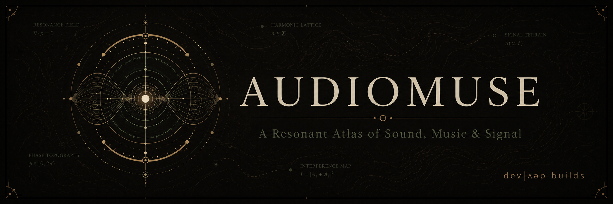

  

# AudioMuse

**A Resonant Atlas of Sound, Music & Signal**

AudioMuse is an expandable, repository-first knowledge atlas for acoustics, music, recording, production, DJing, digital audio, DSP, and machine audio. Sessions preserve chronological exploration; nodes preserve durable conceptual knowledge and connections; vocabulary provides terminology, digital context, and curated cross-references.

## Structure

- `sessions/` — chronological exploration records
- `nodes/` — durable knowledge-graph concepts organized by domain
- `schemas/` — canonical node, vocabulary, and source metadata contracts
- `sources/` — provenance registry referenced by stable source IDs
- `vocabulary/` — canonical terminology entries, source atlases, and a read-only cross-reference index
- `research/` — sources and research notes
- `experiments/` — canonical listening/measurement exercises and a generated cross-reference index
- `assets/brand/` — canonical AudioMuse identity assets and guidelines
- `docs/` — project scope, knowledge model, and roadmap
- `indexes/` — generated, read-only navigation and coverage views

## Current foundation

- Session 01 — What Is Sound?
- Session 02 — What Is Music?
- Session 03 — History of Electronic Music
- Session 01 Vocabulary Atlas
- AudioMuse Brand Identity Guidelines
- A curated 15-node typed relationship graph derived from Sessions 1–3
- A many-to-many session-to-node map and human-readable graph overview
- A dependency-free graph integrity validator
- Deterministic, rebuildable knowledge indexes for graph, session, and provenance inspection
- A validated 38-entry vocabulary foundation with deterministic A-Z, domain, session, and node views
- A validated three-experiment practical foundation with listening, visualization, safety, provenance, and repeatability contracts

See `indexes/README.md` for graph-derived views, `vocabulary/README.md` for vocabulary semantics, `experiments/README.md` for the practical experiment contract, and `docs/session-node-map.md` for the emerging graph. Canonical repository content remains authoritative; indexes are read-only conveniences, not a database or parallel knowledge store. This is a deliberately small foundation, not a complete encyclopedia.

## Project posture

AudioMuse is intentionally small and expandable. It is not intended to become a large software platform. Repository content, linked concepts, research notes, experiments, and focused builds are the primary system.
