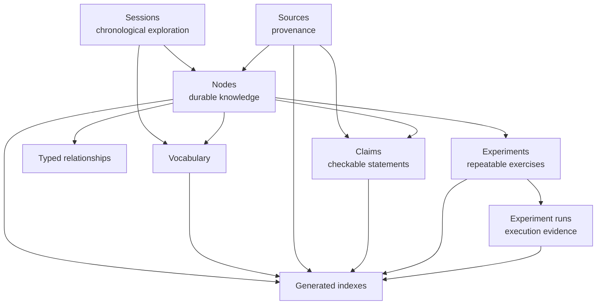

<p align="center">
  
</p>

# AudioMuse

**A Resonant Atlas of Sound, Music & Signal**

AudioMuse is an expandable, repository-first research and knowledge atlas of sound, music, and signal. It connects acoustic physics, psychoacoustics, music and rhythm, recording, production, digital audio, DSP, DJing and turntablism, sound design, spatial audio, machine audio, and cultural and technological history without collapsing those subjects into one undifferentiated encyclopedia.

Canonical repository artifacts remain authoritative. Sessions preserve the chronology of exploration; nodes preserve durable concepts and typed relationships; sources and claims preserve provenance; experiments connect knowledge to repeatable practice; generated indexes make the whole atlas navigable.

## Core knowledge model



Each layer has a distinct job. Vocabulary cross-references are not graph edges; a source relevant to a node is not automatically evidence for every claim on that node; an experiment definition is not evidence that an experiment was performed; and generated indexes never replace canonical authored files.

## Repository map

| Path | Purpose | Authority |
| --- | --- | --- |
| [`sessions/`](sessions/README.md) | Chronological research sessions | canonical |
| [`nodes/`](nodes/README.md) | Durable concepts and typed graph relationships | canonical |
| [`vocabulary/`](vocabulary/README.md) | Terminology, practical context, and curated cross-references | canonical; `index.md` is generated |
| [`sources/`](sources/README.md) | Stable provenance registry | canonical |
| [`claims/`](claims/README.md) | Explicit, checkable statements and their evidence | canonical; `index.md` is generated |
| [`experiments/`](experiments/README.md) | Reusable listening, visualization, and measurement exercises | canonical; `index.md` is generated |
| [`experiment-runs/`](experiment-runs/README.md) | Planned or performed execution and evidence records | canonical; `index.md` is generated |
| [`schemas/`](schemas/) | Metadata and bounded-vocabulary contracts | canonical |
| [`research/`](research/sources/README.md) | Bibliographies and source-specific research notes | supporting provenance |
| [`docs/`](docs/) | Architecture, scope, roadmaps, and domain syntheses | documentation |
| [`indexes/`](indexes/README.md) | Rebuildable navigation and coverage views | generated/read-only |
| [`tools/`](tools/) | Deterministic builders, validators, and integrity tests | tooling |
| [`assets/`](assets/) | Brand and presentation materials | assets |

## Current knowledge areas

The repository currently contains three foundational sessions—what sound is, what music is, and the history of electronic music—and an expanding graph built from session material and registered external research.

### Foundations and musical organization

- acoustics, vibration, frequency, phase, resonance, envelopes, and sound;
- psychoacoustics, pitch, timbre, consonance, dissonance, and auditory perception;
- rhythm, groove, repetition, sequencing, synthesis, MIDI, and digital sampling;
- recording, dynamic-range processing, digital signal processing, and spatial perception.

### DJing, turntablism, and temporal DSP

- DJing, turntables, beatmatching, scratching, turntablism, and digital vinyl systems;
- slowed playback, chopping, chopped-and-screwed practice, and chopped-and-slowed lineage;
- gating, stutter, retriggering, micro-looping, discontinuity, time-stretching, granular fragmentation, and compression as related operations on musical time and event boundaries.

### Houston and the Third Coast

- Houston hip-hop historical cartography and cultural infrastructure;
- DJ Screw, Screw tapes, the Screwed Up Click, Rap-A-Lot, Swishahouse, and related institutions and circulation networks;
- a sourced chronology that preserves attribution, uncertainty, and disputes rather than flattening them into a single story.

### Affective audio and machine analysis

- auditory transduction, roughness, harmonicity, sensory dissonance, expectation, memory, reward, enculturation, and bodily response;
- a layered account of music-evoked emotion spanning cochlear encoding, psychoacoustic features, temporal organization, predictive processing, memory, and culture;
- audio feature extraction and music-emotion recognition, with explicit limits on what signal descriptors can establish about listener experience.

These are current foundations, not claims of complete domain coverage. Coverage views identify review candidates; they do not score truth, quality, or completeness.

## Provenance and confidence

AudioMuse keeps epistemic dimensions separate. A claim record identifies:

- **claim type** — such as `established_fact`, `technical_fact`, `historical_claim`, `attributed_claim`, `oral_history`, `interpretation`, `audiomuse_synthesis`, or `hypothesis`;
- **confidence** — the strength of repository evidence, never a numerical truth score;
- **evidence relationship** — whether a registered source supports, contradicts, or qualifies the claim;
- **dispute status** — whether registered sources conflict;
- **appearance and derivation** — where a claim is made and, for repository synthesis, which prior claims it derives from.

This lets the repository distinguish established evidence, reported or attributed material, interpretation, AudioMuse synthesis, hypothesis, and unresolved dispute. Confidence describes the evidence held by the repository—not certainty, authority, or a model's feeling. See the [claim provenance model](docs/claim-provenance-model.md) for the full contract.

## Validation and generated views

The repository uses dependency-free PowerShell tooling. From the repository root, the compact integrity sequence is:

```powershell
pwsh -NoProfile -File tools/validate-graph.ps1
pwsh -NoProfile -File tools/validate-knowledge-index.ps1
pwsh -NoProfile -File tools/validate-knowledge-coverage.ps1
pwsh -NoProfile -File tools/validate-vocabulary.ps1
pwsh -NoProfile -File tools/validate-experiments.ps1
pwsh -NoProfile -File tools/validate-experiment-runs.ps1
pwsh -NoProfile -File tools/validate-claims.ps1
pwsh -NoProfile -File tools/test-reference-integrity.ps1
```

Builders named `tools/build-*.ps1` regenerate the corresponding checked-in indexes. Validators reconcile those projections with canonical files and fail when generated output is stale. The [index guide](indexes/README.md) documents the generated views and their boundaries.

## Current status

AudioMuse now has:

- foundational sound, music, and electronic-music sessions;
- a validated typed knowledge graph and deterministic navigation indexes;
- terminology and cross-layer vocabulary views;
- reusable experiment definitions separated from run evidence;
- first-class source registration, claim provenance, evidence confidence, and dispute handling;
- established DJ/turntablism and Houston/Third Coast research foundations;
- an affective psychoacoustics and temporal-DSP mechanism stack.

Detailed phase history and future direction live in the [roadmap](docs/roadmap.md), not in this entry point.

## Research philosophy

AudioMuse aims to explain deeply, connect disciplines, distinguish evidence from interpretation, preserve provenance, and let future topics join an expandable atlas rather than become isolated notes. It prefers an explicit gap to an unsupported sentence and a bounded relationship to an attractive but untraceable association.

## What AudioMuse is not

AudioMuse is not complete, a replacement for primary literature, a traditional course, a generic music blog, a large software platform, or an autonomously generated source of truth. Generated indexes are disposable views over canonical repository content—not a graph database or a second knowledge store.

## Start here

- **Understand the architecture:** [knowledge model](docs/knowledge-model.md), [project scope](docs/project-scope.md), and [session-to-node map](docs/session-node-map.md)
- **Explore the graph:** [generated index guide](indexes/README.md) and [knowledge coverage](indexes/knowledge-coverage.md)
- **Understand provenance:** [claim provenance model](docs/claim-provenance-model.md), [claims guide](claims/README.md), and [sources guide](sources/README.md)
- **Explore research domains:** [Houston musical cartography](docs/houston-musical-cartography.md) and [affective mechanism stack](docs/affective-mechanism-stack.md)
- **Run experiments:** [experiment definitions](experiments/README.md) and [experiment-run evidence](experiment-runs/README.md)
- **Follow project direction:** [roadmap](docs/roadmap.md) and [research-gap triage](docs/research-gap-triage.md)
