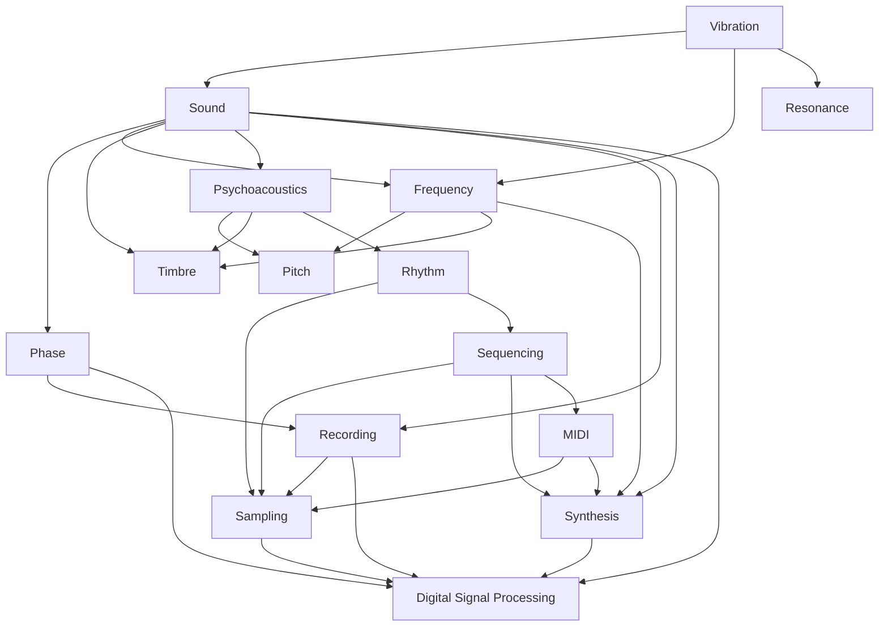

# Session-to-Node Map

This map shows how chronological Sessions 1–3 contribute to durable AudioMuse nodes. It is many-to-many provenance: a session can develop many nodes, and a node can be developed by multiple sessions. Inclusion does not assign ownership to a session or replace the canonical `session_origin` and `sources` fields in each node.

## Session 1 — What Is Sound?

- `sound`
- `vibration`
- `frequency`
- `phase`
- `resonance`
- `pitch`
- `timbre`
- `psychoacoustics`
- `recording`
- `sampling`
- `digital-signal-processing`

## Session 2 — What Is Music?

- `sound`
- `frequency`
- `phase`
- `resonance`
- `pitch`
- `timbre`
- `psychoacoustics`
- `rhythm`
- `sampling`
- `synthesis`
- `sequencing`
- `midi`
- `digital-signal-processing`

## Session 3 — History of Electronic Music

- `vibration`
- `rhythm`
- `recording`
- `sampling`
- `synthesis`
- `sequencing`
- `midi`
- `digital-signal-processing`

## Emerging graph

This diagram is an explanatory view of selected explicit `related_nodes` links. The node files remain canonical.

## Curation boundary

A vocabulary entry is a concise terminology reference. A canonical node is a durable concept selected to accumulate relationships, provenance, sessions, experiments, projects, and deeper research. Terms do not become nodes automatically and may remain vocabulary-only indefinitely.
